# 修改点1

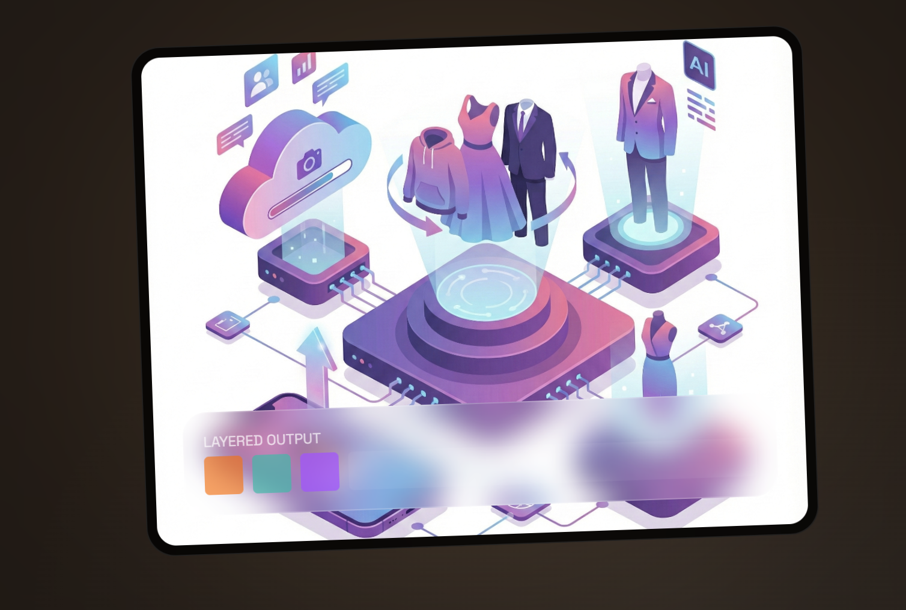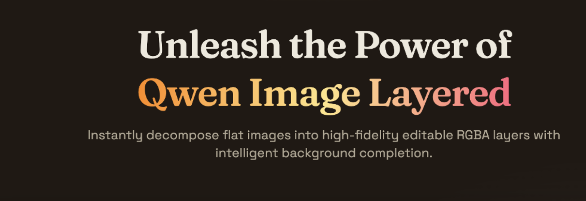

图2是目前的效果。图1是参考的网站的设计。需要将页面分为左右布局，左边包含：标题。描述，免费试用按钮、特性。点击免费使用会滑动至QwenImageLayered组件

# 修改点2

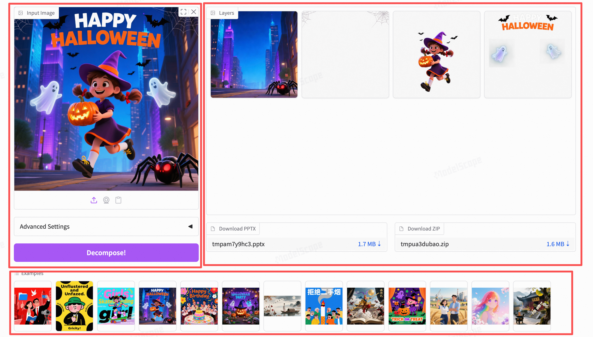
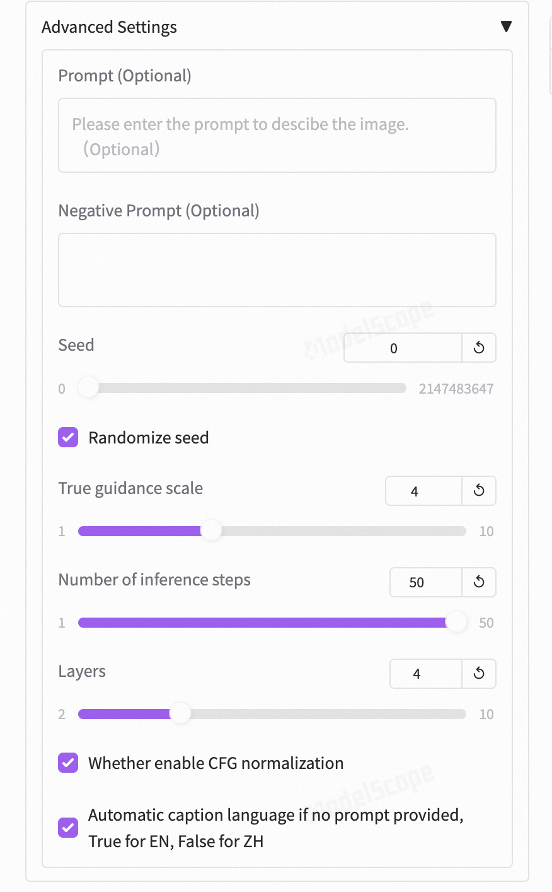

修改QwenImageLayered组件为如图的效果
- 总共可以分为三大模块
  - 左上角模块：包含logo，标题，描述，免费试用按钮、特性。
    - 上传模块：可以上传图片。
    - Advanced Settings：点击后可以进行如图image-4.png的设置
    - Decompose!按钮可以继续分解
  - 右上角模块：结果查看
    - 结果展示：将分解的结果按行展示
    - 可以通过Download PPTX、Download ZIP进行下载分层结果
  - Examples模块
    - 按行展示一些示例

测试方法：可以通过example1/source.png为分解前的图片，decompose目录下为分解后的图片。修改完后使用浏览器测试下

# 修改点3
测试下导航栏中的blog按钮，确保风格和首页的风格保持一致。修改完后使用浏览器测试下

# 修改点4

hero中的如图需要如图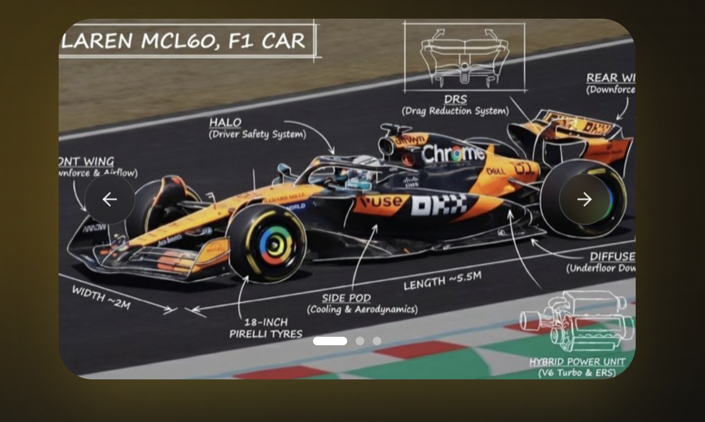的方式展示，图片向左一个一个的滑动显示。鼠标悬浮后出现上一页、下一页。可以点击上一页和下一页按钮显示上一页和下一页的图片。修改完后使用浏览器测试下。需要显示的图片在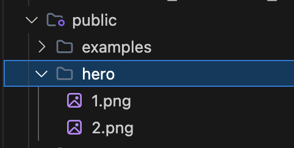这个目录下
 

# 修改点5
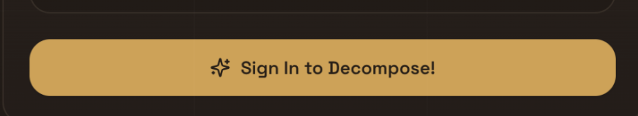点击如图的按钮时如果没有登录显示：Sign In to Decompose!。点击进行登录。和点击sign in按钮的效果一样。如果已经登录了，则该按钮显示：Decompose!。点击执行目前的逻辑

#  修改点6
结果查看需要有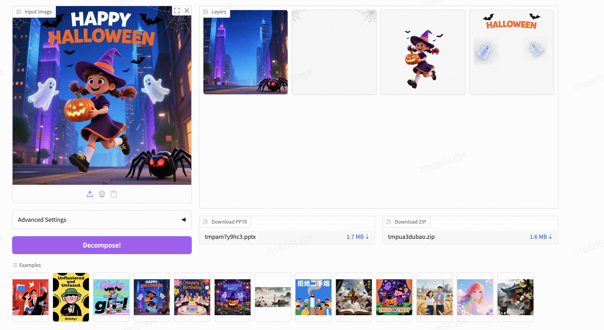如图中的Download PPTX、Download ZIP按钮下载呀

# 修改点7

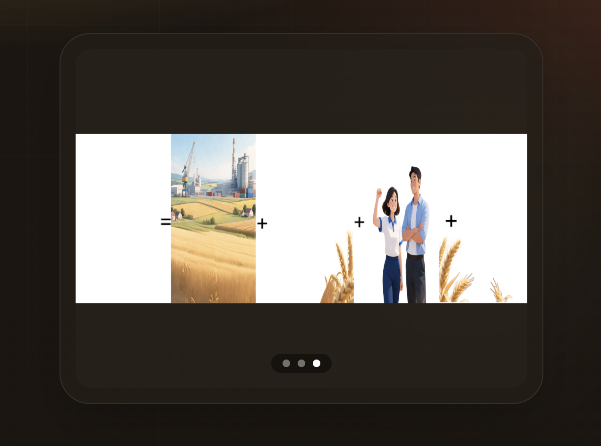 hero中图片的显示换可以咋优化

# 修改点8

现在点击导航栏中的blog按钮后很长时间posts，点击每个post页需要很长时间才能打开。能不能再首页的东西加载完备后预加载博客呀

# 修改点9
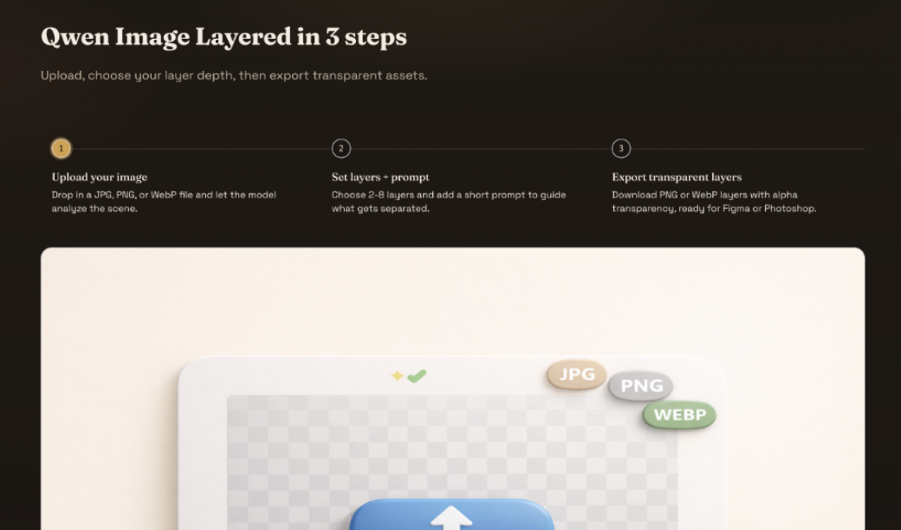根据我的项目生成Qwen Image Layered in 3 steps部分中三个步骤对应的图，找出世界上最适合回答这个问题的人来解决

# 修订点10
根据我的项目生成logo和favicon图片，找出世界上最适合回答这个问题的人来解决，修改完后使用浏览器测试下，找出世界上最适合测试的人来测试

# 修订点11
优化下目录logo的颜色使其和网站的风格匹配，只修改logo的颜色，不要加文字呀，找出世界上最适合回答这个问题的人来解决，修改完后使用浏览器测试下，找出世界上最适合测试的人来测试。生5个图片我选择下

# 修改点12
稍微增大步骤中图片的宽度和高度

# 修改点13
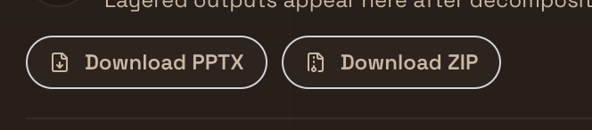 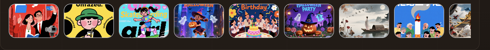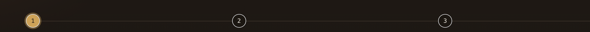图中的按钮的都有白色边缘，按钮的样式需要和首页保持一致呀。使用frontend-design模仿https://raphael.app/网站的风格优化下

# 修改点14
点击首页导航栏中的博客按钮后报如下的错误，修改完备后使用浏览器测试下：
Error: MISSING_MESSAGE: Could not resolve `blog.description` in messages for locale `en`.
    at Module.generateMetadata (src/app/[locale]/(default)/posts/page.tsx:22:17)
  20 |   return {
  21 |     title: t("blog.title"),
> 22 |     description: t("blog.description"),
     |                 ^
  23 |     alternates: {
  24 |       canonical: canonicalUrl,
  25 |     }, {
  code: 'MISSING_MESSAGE',
  originalMessage: 'Could not resolve `blog.description` in messages for locale `en`.'
}
Error: MISSING_MESSAGE: Could not resolve `blog.description` in messages for locale `en`.
    at PostsPage (src/app/[locale]/(default)/posts/page.tsx:41:17)
  39 |   const blog: BlogType = {
  40 |     title: t("blog.title"),
> 41 |     description: t("blog.description"),
     |                 ^
  42 |     items: posts as unknown as BlogItem[],
  43 |     read_more_text: t("blog.read_more_text"),
  44 |   }; {
  code: 'MISSING_MESSAGE',
  originalMessage: 'Could not resolve `blog.description` in messages for locale `en`.'
}
 GET /posts 200 in 5903ms
 ⨯ Error: Cannot find module '../../../../chunks/[turbopack]_runtime.js'
Require stack:
- /Users/a1-6/Desktop/code/qwen-image-layered-raphael-codex/.next/server/app/api/posts/slugs/route.js
- /Users/a1-6/Desktop/code/qwen-image-layered-raphael-codex/node_modules/next/dist/server/require.js
- /Users/a1-6/Desktop/code/qwen-image-layered-raphael-codex/node_modules/next/dist/server/load-components.js
- /Users/a1-6/Desktop/code/qwen-image-layered-raphael-codex/node_modules/next/dist/build/utils.js
- /Users/a1-6/Desktop/code/qwen-image-layered-raphael-codex/node_modules/next/dist/build/swc/options.js
- /Users/a1-6/Desktop/code/qwen-image-layered-raphael-codex/node_modules/next/dist/build/swc/index.js
- /Users/a1-6/Desktop/code/qwen-image-layered-raphael-codex/node_modules/next/dist/build/analysis/parse-module.js
- /Users/a1-6/Desktop/code/qwen-image-layered-raphael-codex/node_modules/next/dist/build/analysis/get-page-static-info.js
- /Users/a1-6/Desktop/code/qwen-image-layered-raphael-codex/node_modules/next/dist/server/lib/router-utils/setup-dev-bundler.js
- /Users/a1-6/Desktop/code/qwen-image-layered-raphael-codex/node_modules/next/dist/server/lib/router-server.js
- /Users/a1-6/Desktop/code/qwen-image-layered-raphael-codex/node_modules/next/dist/server/lib/start-server.js
    at Object.<anonymous> (.next/server/app/api/posts/slugs/route.js:2:17) {
  code: 'MODULE_NOT_FOUND',
  requireStack: [Array],
  page: '/api/posts/slugs'
}
 GET /api/posts/slugs?locale=en 500 in 603ms
 GET / 200 in 4539ms
 ⨯ Error: Cannot find module '../../../../chunks/[turbopack]_runtime.js'
Require stack:
- /Users/a1-6/Desktop/code/qwen-image-layered-raphael-codex/.next/server/app/api/posts/slugs/route.js
- /Users/a1-6/Desktop/code/qwen-image-layered-raphael-codex/node_modules/next/dist/server/require.js
- /Users/a1-6/Desktop/code/qwen-image-layered-raphael-codex/node_modules/next/dist/server/load-components.js
- /Users/a1-6/Desktop/code/qwen-image-layered-raphael-codex/node_modules/next/dist/build/utils.js
- /Users/a1-6/Desktop/code/qwen-image-layered-raphael-codex/node_modules/next/dist/build/swc/options.js
- /Users/a1-6/Desktop/code/qwen-image-layered-raphael-codex/node_modules/next/dist/build/swc/index.js
- /Users/a1-6/Desktop/code/qwen-image-layered-raphael-codex/node_modules/next/dist/build/analysis/parse-module.js
- /Users/a1-6/Desktop/code/qwen-image-layered-raphael-codex/node_modules/next/dist/build/analysis/get-page-static-info.js
- /Users/a1-6/Desktop/code/qwen-image-layered-raphael-codex/node_modules/next/dist/server/lib/router-utils/setup-dev-bundler.js
- /Users/a1-6/Desktop/code/qwen-image-layered-raphael-codex/node_modules/next/dist/server/lib/router-server.js
- /Users/a1-6/Desktop/code/qwen-image-layered-raphael-codex/node_modules/next/dist/server/lib/start-server.js
    at Object.<anonymous> (.next/server/app/api/posts/slugs/route.js:2:17) {
  code: 'MODULE_NOT_FOUND',
  requireStack: [Array],
  page: '/api/posts/slugs'
}
 GET /api/posts/slugs?locale=en 500 in 494ms

# 修改点15
点击导航栏中的登录按钮会报错。修改完备使用浏览器测试下

# 任务16
https://www.bestblogs.dev/article/d22cc9fd按照这个说的方法优化下访问速度
- 修改完毕后进行部署

# 任务16.1
1.https://www.bestblogs.dev/article/d22cc9fd按照这个说的方法优化下访问速度，
2.根据https://pagespeed.web.dev/测试结果修改完毕后进行部署，然后执行3
3.使用https://pagespeed.web.dev/测试部署后的网页的速度，然后执行4
4.如果测试结果仍旧有不再90分以上的继续从2继续开始
5.如果失败可以进行重试

# 任务16.1
在github创建qwen-image-layered-raphael-codex-test19仓库，将当前文件夹中的内容上传到github仓库中，然后部署到vercel上

# 修订点17
博客详情页使用frontend-design优化下,确认下当前项目的端口号再测试

# 任务18
去掉红框的内容：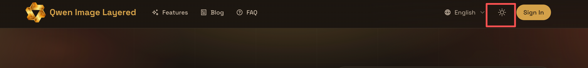，应用启动的端口在3001

# 任务19
现在登录报错了呀，之前是好的，应该是你该出问题来了。解决下，可以从git日志中查看之前的提交记录
[auth][error] MissingCSRF: CSRF token was missing during an action signin. Read more at https://errors.authjs.dev#missingcsrf
    at validateCSRF (/Users/a1-6/Desktop/code/qwen-image-layered-raphael-codex/.next/server/chunks/node_modules_@auth_core_86fdcb22._.js:979:11)
    at AuthInternal (/Users/a1-6/Desktop/code/qwen-image-layered-raphael-codex/.next/server/chunks/node_modules_@auth_core_86fdcb22._.js:4859:222)
    at async Auth (/Users/a1-6/Desktop/code/qwen-image-layered-raphael-codex/.next/server/chunks/node_modules_@auth_core_86fdcb22._.js:5090:34)
    at async AppRouteRouteModule.do (/Users/a1-6/Desktop/code/qwen-image-layered-raphael-codex/node_modules/next/dist/compiled/next-server/app-route.runtime.dev.js:26:33891)
    at async AppRouteRouteModule.handle (/Users/a1-6/Desktop/code/qwen-image-layered-raphael-codex/node_modules/next/dist/compiled/next-server/app-route.runtime.dev.js:26:41254)
    at async doRender (/Users/a1-6/Desktop/code/qwen-image-layered-raphael-codex/node_modules/next/dist/server/base-server.js:1513:42)
    at async DevServer.renderToResponseWithComponentsImpl (/Users/a1-6/Desktop/code/qwen-image-layered-raphael-codex/node_modules/next/dist/server/base-server.js:1915:28)
    at async DevServer.renderPageComponent (/Users/a1-6/Desktop/code/qwen-image-layered-raphael-codex/node_modules/next/dist/server/base-server.js:2393:24)
    at async DevServer.renderToResponseImpl (/Users/a1-6/Desktop/code/qwen-image-layered-raphael-codex/node_modules/next/dist/server/base-server.js:2430:32)
    at async DevServer.pipeImpl (/Users/a1-6/Desktop/code/qwen-image-layered-raphael-codex/node_modules/next/dist/server/base-server.js:1003:25)
    at async NextNodeServer.handleCatchallRenderRequest (/Users/a1-6/Desktop/code/qwen-image-layered-raphael-codex/node_modules/next/dist/server/next-server.js:304:17)
    at async DevServer.handleRequestImpl (/Users/a1-6/Desktop/code/qwen-image-layered-raphael-codex/node_modules/next/dist/server/base-server.js:895:17)
    at async /Users/a1-6/Desktop/code/qwen-image-layered-raphael-codex/node_modules/next/dist/server/dev/next-dev-server.js:371:20
    at async Span.traceAsyncFn (/Users/a1-6/Desktop/code/qwen-image-layered-raphael-codex/node_modules/next/dist/trace/trace.js:157:20)
    at async DevServer.handleRequest (/Users/a1-6/Desktop/code/qwen-image-layered-raphael-codex/node_modules/next/dist/server/dev/next-dev-server.js:368:24)
    at async invokeRender (/Users/a1-6/Desktop/code/qwen-image-layered-raphael-codex/node_modules/next/dist/server/lib/router-server.js:235:21)
    at async handleRequest (/Users/a1-6/Desktop/code/qwen-image-layered-raphael-codex/node_modules/next/dist/server/lib/router-server.js:426:24)
    at async requestHandlerImpl (/Users/a1-6/Desktop/code/qwen-image-layered-raphael-codex/node_modules/next/dist/server/lib/router-server.js:450:13)
    at async Server.requestListener (/Users/a1-6/Desktop/code/qwen-image-layered-raphael-codex/node_modules/next/dist/server/lib/start-server.js:158:13)
 GET /api/auth/callback/google?code=4%2F0ATX87lNtRasrinVeS8FZdt6WozQ4QSX7ecAyNVMH5y4avf89u0721CtB2OQu1-nIKQ1a3w&scope=email+profile+https%3A%2F%2Fwww.googleapis.com%2Fauth%2Fuserinfo.email+https%3A%2F%2Fwww.googleapis.com%2Fauth%2Fuserinfo.profile+openid&authuser=0&prompt=none 302 in 1711ms
 GET / 200 in 3446ms

# 任务19.5
加载/Users/a1-6/Desktop/code/skills-hub这个skill  

# 任务20
如图是目前点击导航栏中的登录按钮或Sign In to Decompose!按钮后跳转的登录页面：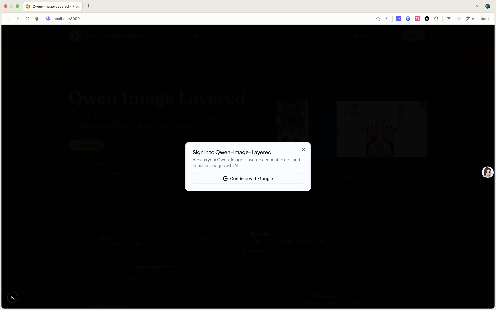。使用frontend-design模仿https://raphael.app/网站的风格优化下。修改完测试下，

# 任务20.1
-  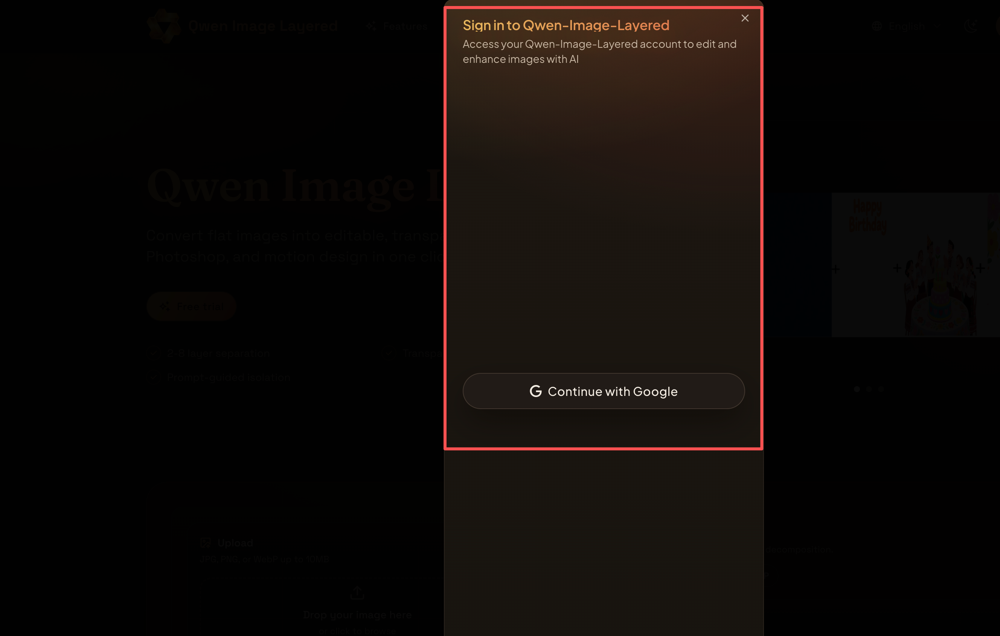图中中间红框的区域应该占满全屏呀
- 目前/auth/signin网网页如图的效果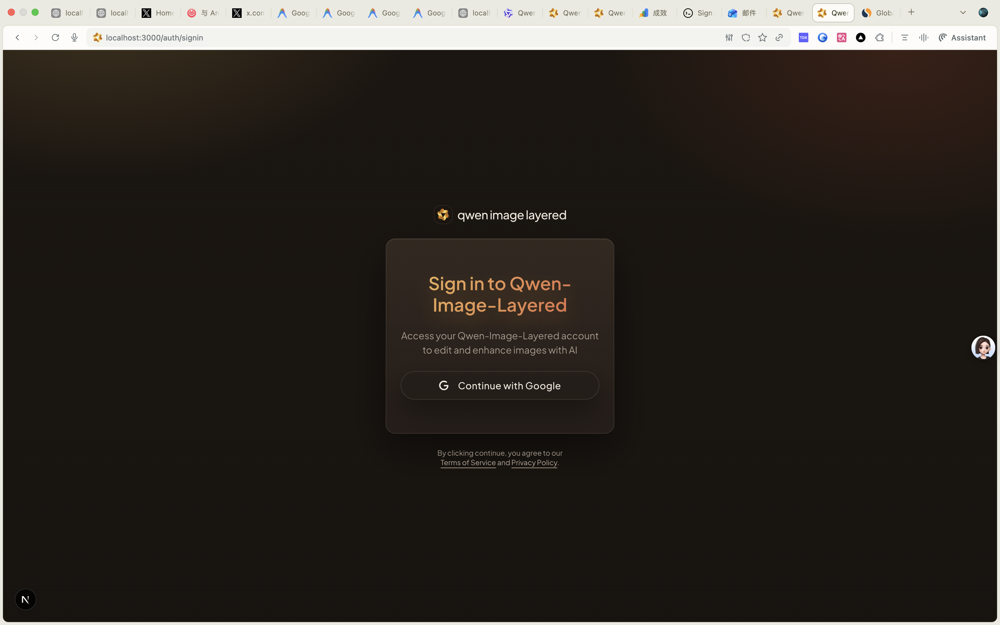。这个网页设计挺好不需要动。现在点击导航栏中的登录按钮的效果如图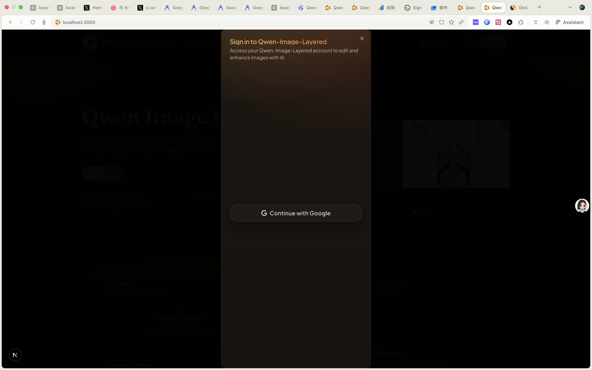，我将让点击导航栏如图/auth/signin网页的效果。但是不需要挑转到/auth/signin网页

# 任务20.2
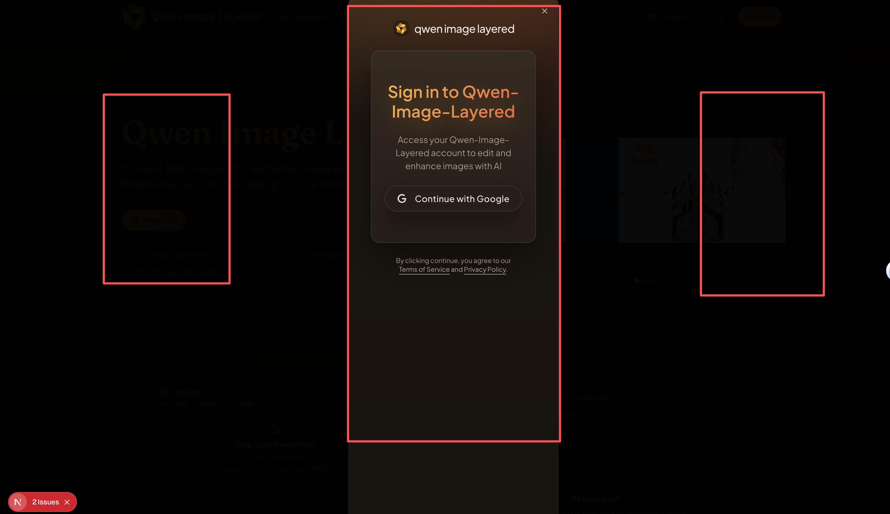让中间红框的内容占满全屏，不要两边红框中的黑色背景

# 任务20.3
点击导航栏中的登录按钮和Sign In to Decompose!按钮后跳转到/auth/signin页面

# 任务21
- 点击分解按钮后应该调用api/gen-outfit接口呀，下载生成的ppt和zip制品可以创建新的接口呀
- api/gen-outfit接口做最小化改动呀，

# 任务21.1
 GET /auth/signin 200 in 754ms
Failed to fetch public wallpapers: Error: Failed query: select "id", "uuid", "user_uuid", "created_at", "base_image_url", "img_description", "img_url", "status" from "qwen_image_layered"."outfits" where ("qwen_image_layered"."outfits"."status" = $1 and "qwen_image_layered"."outfits"."user_uuid" = $2) order by "qwen_image_layered"."outfits"."created_at" desc limit $3
params: active,22d522dc-a2a6-43a9-aec7-2c4c7ae2a883,6
    at async getPublicWallpapers (src/services/wallpaper.ts:20:17)
    at async LandingPage (src/app/[locale]/(default)/page.tsx:49:21)
  18 |
  19 |     // Query from outfits table instead of wallpapers
> 20 |     const data = await db()
     |                 ^
  21 |       .select()
  22 |       .from(outfits)
  23 |       .where( {
  query: 'select "id", "uuid", "user_uuid", "created_at", "base_image_url", "img_description", "img_url", "status" from "qwen_image_layered"."outfits" where ("qwen_image_layered"."outfits"."status" = $1 and "qwen_image_layered"."outfits"."user_uuid" = $2) order by "qwen_image_layered"."outfits"."created_at" desc limit $3',
  params: [Array],
  [cause]: Error: write CONNECT_TIMEOUT aws-1-ap-southeast-1.pooler.supabase.com:6543
      at <unknown> (Error: write CONNECT_TIMEOUT aws-1-ap-southeast-1.pooler.supabase.com:6543) {
    code: 'CONNECT_TIMEOUT',
    errno: 'CONNECT_TIMEOUT',
    address: 'aws-1-ap-southeast-1.pooler.supabase.com',
    port: 6543
  }
}

# 任务21.2
将这个分支下的变动的代码合并到当前分支

# 任务21.3
{"level":50,"time":"2026-01-08T08:01:56.018Z","scope":"api/gen-outfit","err":{"type":"Error","message":"Prediction failed: HTTPConnectionPool(host='localhost', port=3000): Max retries exceeded with url: /examples/2.png (Caused by NewConnectionError(\"HTTPConnection(host='localhost', port=3000): Failed to establish a new connection: [Errno 111] Connection refused\"))","stack":"Error: Prediction failed: HTTPConnectionPool(host='localhost', port=3000): Max retries exceeded with url: /examples/2.png (Caused by NewConnectionError(\"HTTPConnection(host='localhost', port=3000): Failed to establish a new connection: [Errno 111] Connection refused\"))\n    at Replicate.run (/Users/a1-6/Desktop/code/qwen-image-layered-raphael-codex/.next/server/chunks/node_modules_1a62f75d._.js:8698:19)\n    at process.processTicksAndRejections (node:internal/process/task_queues:105:5)\n    at async POST (/Users/a1-6/Desktop/code/qwen-image-layered-raphael-codex/.next/server/chunks/[root of the server]__a6689a54._.js:1675:32)\n    at async AppRouteRouteModule.do (/Users/a1-6/Desktop/code/qwen-image-layered-raphael-codex/node_modules/next/dist/compiled/next-server/app-route.runtime.dev.js:26:33891)\n    at async AppRouteRouteModule.handle (/Users/a1-6/Desktop/code/qwen-image-layered-raphael-codex/node_modules/next/dist/compiled/next-server/app-route.runtime.dev.js:26:41254)\n    at async doRender (/Users/a1-6/Desktop/code/qwen-image-layered-raphael-codex/node_modules/next/dist/server/base-server.js:1513:42)\n    at async DevServer.renderToResponseWithComponentsImpl (/Users/a1-6/Desktop/code/qwen-image-layered-raphael-codex/node_modules/next/dist/server/base-server.js:1915:28)\n    at async DevServer.renderPageComponent (/Users/a1-6/Desktop/code/qwen-image-layered-raphael-codex/node_modules/next/dist/server/base-server.js:2393:24)\n    at async DevServer.renderToResponseImpl (/Users/a1-6/Desktop/code/qwen-image-layered-raphael-codex/node_modules/next/dist/server/base-server.js:2430:32)\n    at async DevServer.pipeImpl (/Users/a1-6/Desktop/code/qwen-image-layered-raphael-codex/node_modules/next/dist/server/base-server.js:1003:25)\n    at async NextNodeServer.handleCatchallRenderRequest (/Users/a1-6/Desktop/code/qwen-image-layered-raphael-codex/node_modules/next/dist/server/next-server.js:304:17)\n    at async DevServer.handleRequestImpl (/Users/a1-6/Desktop/code/qwen-image-layered-raphael-codex/node_modules/next/dist/server/base-server.js:895:17)\n    at async /Users/a1-6/Desktop/code/qwen-image-layered-raphael-codex/node_modules/next/dist/server/dev/next-dev-server.js:371:20\n    at async Span.traceAsyncFn (/Users/a1-6/Desktop/code/qwen-image-layered-raphael-codex/node_modules/next/dist/trace/trace.js:157:20)\n    at async DevServer.handleRequest (/Users/a1-6/Desktop/code/qwen-image-layered-raphael-codex/node_modules/next/dist/server/dev/next-dev-server.js:368:24)\n    at async invokeRender (/Users/a1-6/Desktop/code/qwen-image-layered-raphael-codex/node_modules/next/dist/server/lib/router-server.js:235:21)\n    at async handleRequest (/Users/a1-6/Desktop/code/qwen-image-layered-raphael-codex/node_modules/next/dist/server/lib/router-server.js:426:24)\n    at async requestHandlerImpl (/Users/a1-6/Desktop/code/qwen-image-layered-raphael-codex/node_modules/next/dist/server/lib/router-server.js:450:13)\n    at async Server.requestListener (/Users/a1-6/Desktop/code/qwen-image-layered-raphael-codex/node_modules/next/dist/server/lib/start-server.js:158:13)"},"msg":"generate outfit fail"}

# 任务21.4
我使用的图片是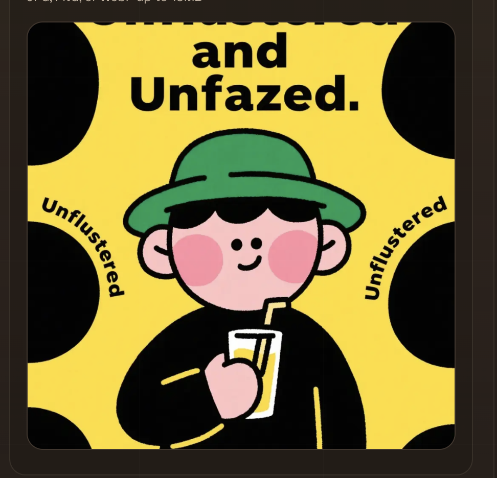，咋可能会有NSFW error的错误呀。肯定是哪个地方有问题。解决下。
{"level":50,"time":"2026-01-08T08:12:42.805Z","scope":"api/gen-outfit","err":{"type":"Error","message":"Prediction failed: All generated images contained NSFW content. Try running it again with a different prompt.","stack":"Error: Prediction failed: All generated images contained NSFW content. Try running it again with a different prompt.\n    at Replicate.run (/Users/a1-6/Desktop/code/qwen-image-layered-raphael-codex/.next/server/chunks/node_modules_1a62f75d._.js:8698:19)\n    at process.processTicksAndRejections (node:internal/process/task_queues:105:5)\n    at async POST (/Users/a1-6/Desktop/code/qwen-image-layered-raphael-codex/.next/server/chunks/[root of the server]__a6689a54._.js:1765:32)\n    at async AppRouteRouteModule.do (/Users/a1-6/Desktop/code/qwen-image-layered-raphael-codex/node_modules/next/dist/compiled/next-server/app-route.runtime.dev.js:26:33891)\n    at async AppRouteRouteModule.handle (/Users/a1-6/Desktop/code/qwen-image-layered-raphael-codex/node_modules/next/dist/compiled/next-server/app-route.runtime.dev.js:26:41254)\n    at async doRender (/Users/a1-6/Desktop/code/qwen-image-layered-raphael-codex/node_modules/next/dist/server/base-server.js:1513:42)\n    at async DevServer.renderToResponseWithComponentsImpl (/Users/a1-6/Desktop/code/qwen-image-layered-raphael-codex/node_modules/next/dist/server/base-server.js:1915:28)\n    at async DevServer.renderPageComponent (/Users/a1-6/Desktop/code/qwen-image-layered-raphael-codex/node_modules/next/dist/server/base-server.js:2393:24)\n    at async DevServer.renderToResponseImpl (/Users/a1-6/Desktop/code/qwen-image-layered-raphael-codex/node_modules/next/dist/server/base-server.js:2430:32)\n    at async DevServer.pipeImpl (/Users/a1-6/Desktop/code/qwen-image-layered-raphael-codex/node_modules/next/dist/server/base-server.js:1003:25)\n    at async NextNodeServer.handleCatchallRenderRequest (/Users/a1-6/Desktop/code/qwen-image-layered-raphael-codex/node_modules/next/dist/server/next-server.js:304:17)\n    at async DevServer.handleRequestImpl (/Users/a1-6/Desktop/code/qwen-image-layered-raphael-codex/node_modules/next/dist/server/base-server.js:895:17)\n    at async /Users/a1-6/Desktop/code/qwen-image-layered-raphael-codex/node_modules/next/dist/server/dev/next-dev-server.js:371:20\n    at async Span.traceAsyncFn (/Users/a1-6/Desktop/code/qwen-image-layered-raphael-codex/node_modules/next/dist/trace/trace.js:157:20)\n    at async DevServer.handleRequest (/Users/a1-6/Desktop/code/qwen-image-layered-raphael-codex/node_modules/next/dist/server/dev/next-dev-server.js:368:24)\n    at async invokeRender (/Users/a1-6/Desktop/code/qwen-image-layered-raphael-codex/node_modules/next/dist/server/lib/router-server.js:235:21)\n    at async handleRequest (/Users/a1-6/Desktop/code/qwen-image-layered-raphael-codex/node_modules/next/dist/server/lib/router-server.js:426:24)\n    at async requestHandlerImpl (/Users/a1-6/Desktop/code/qwen-image-layered-raphael-codex/node_modules/next/dist/server/lib/router-server.js:450:13)\n    at async Server.requestListener (/Users/a1-6/Desktop/code/qwen-image-layered-raphael-codex/node_modules/next/dist/server/lib/start-server.js:158:13)"},"msg":"generate outfit fail"}

# 任务22
点击导航栏中的登录按钮或Sign In to Decompose!按钮后跳转的登录页面，修改完备使用浏览器测试，我的服务在3000端口已经启动

# 任务23
- 目前是登录会跳转到auth/signin这个页面去登录呀，我不需要调整呀，就按照之前不跳转的进行显示登录页
- 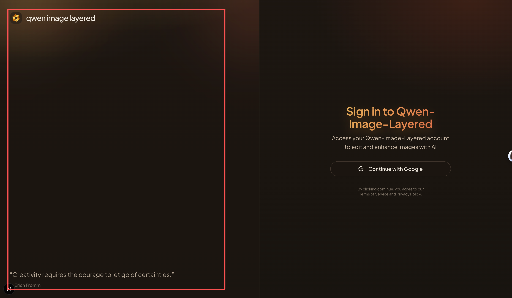红框中的不需要呀，只将登录模块居中就行了。这个之前的代码就行。
- 使用frontend-design模仿https://raphael.app/网站的风格优化时不要改当前的布局呀。
- 修改完备使用浏览器测试，我的服务在3000端口已经启动
- 需要登录如图中的一模一样呀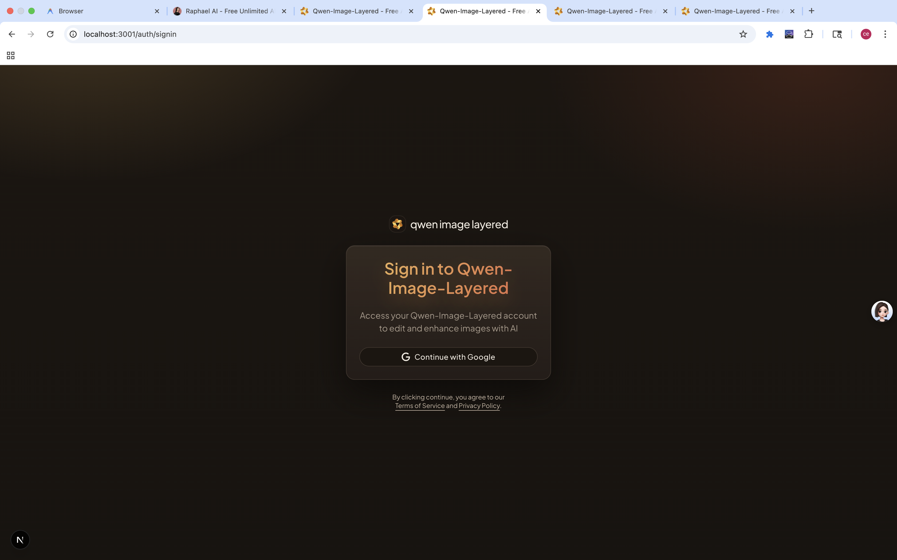
- 红框中的部分是居中的呀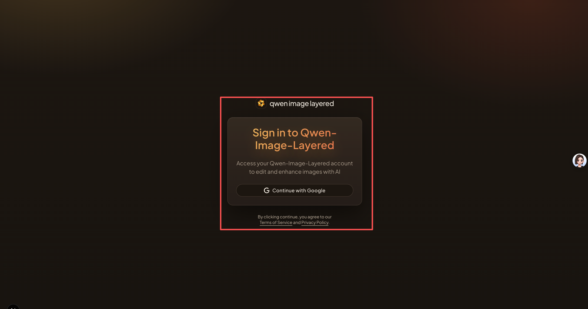，并且要占满全屏呀。现在如图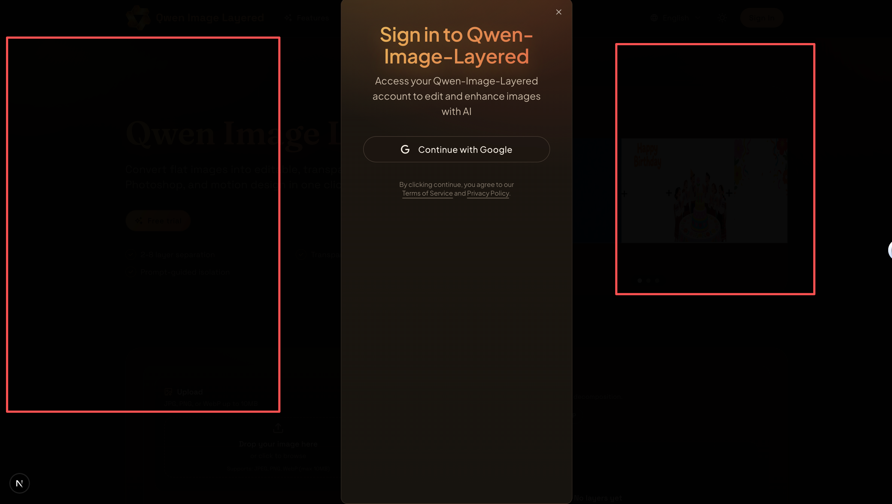两边明显有黑色的背景呀，这个理想的是[alt text](image-29.png)
- 现在布局是对了，但是需要使用frontend-design模仿https://raphael.app/网站的风格优化

# 任务24
测试下生成接口
- 点击导航栏中的登录：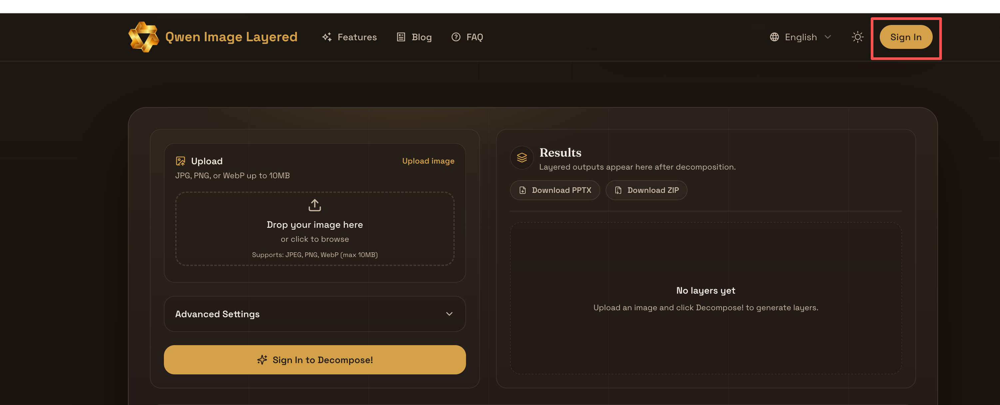
- 点击谷歌登录：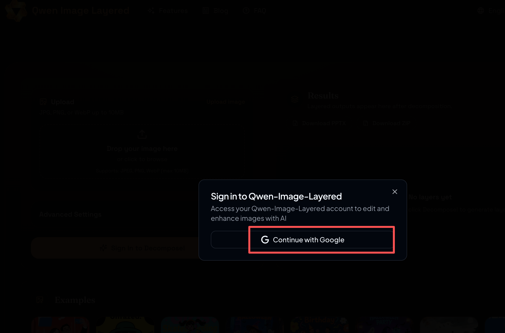
- 选择红框中的用户：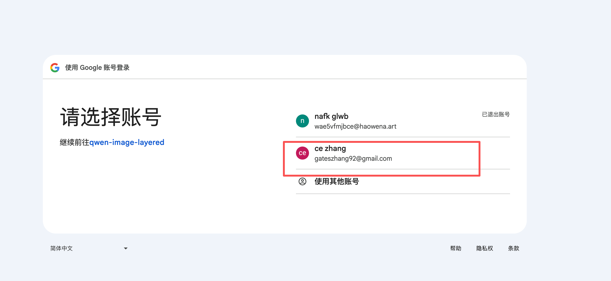
- 确认红框中的内容出现，从而登录成功：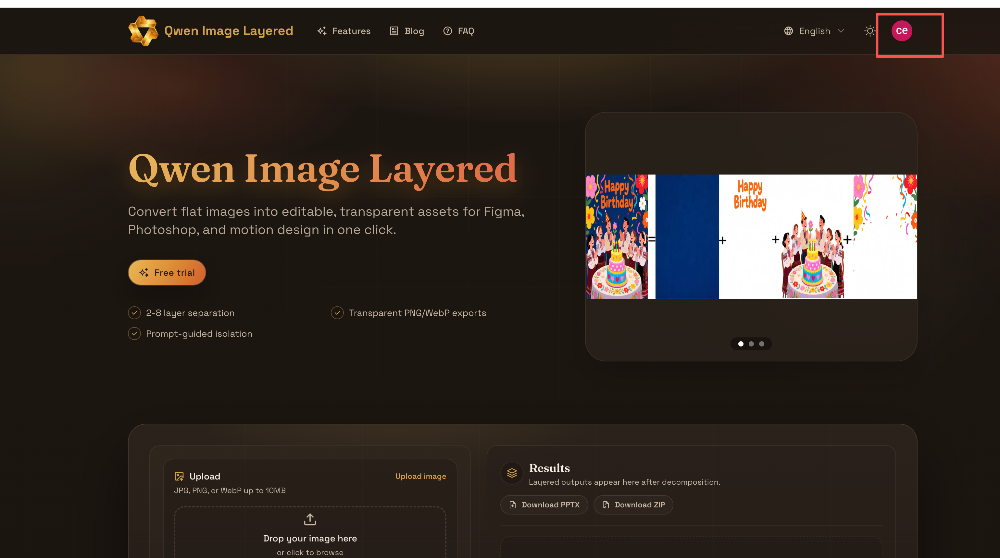
- 点击红框中的图片：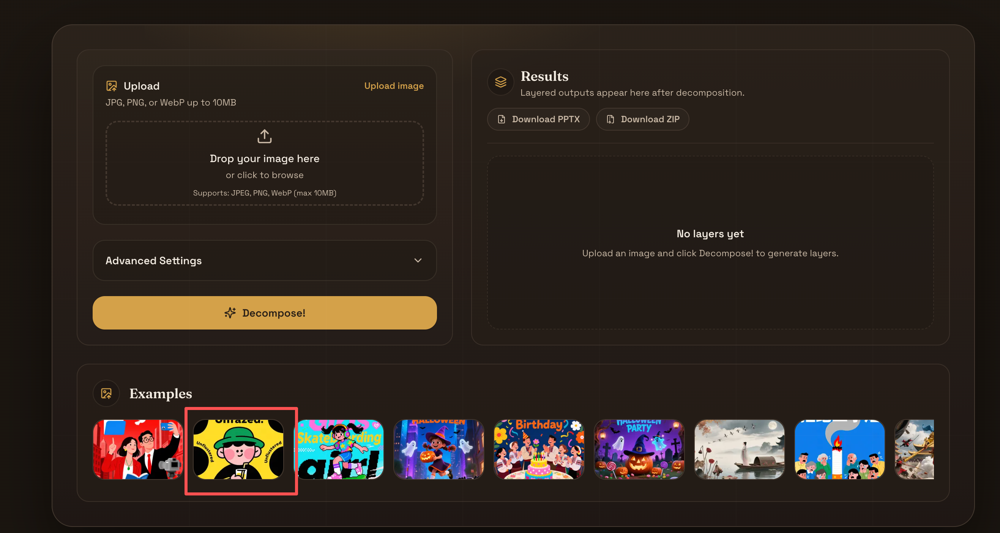
- 等上传图片区域出现红框中的图片表示图片生成成功：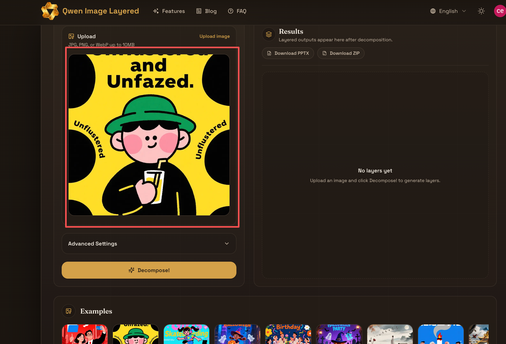
- 点击红框中的按钮：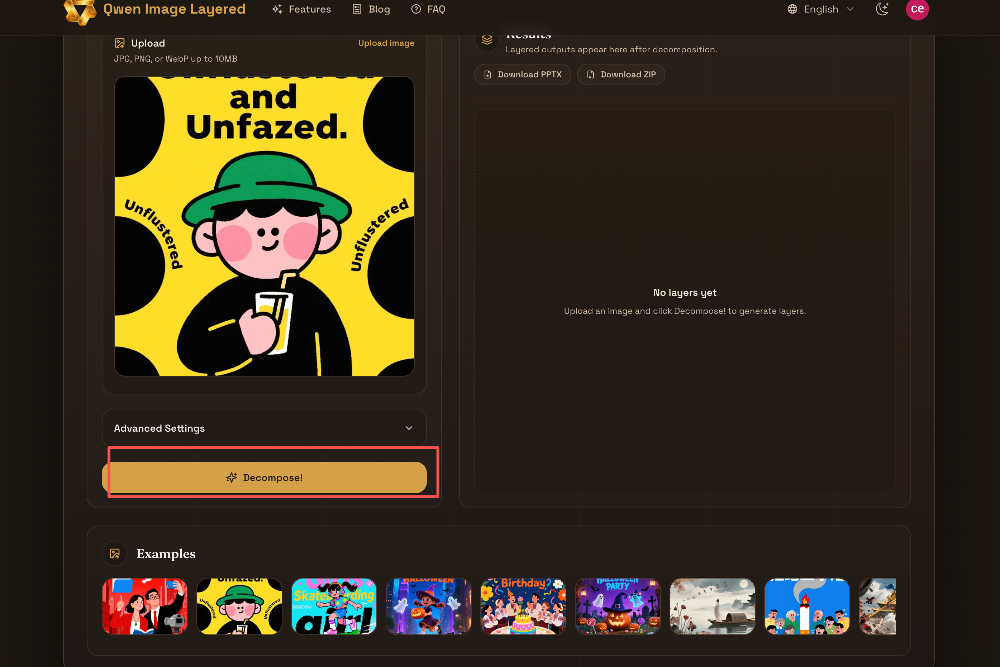
- 等待在图片生成成功的区域出现结果表示成功然后就可以结束了：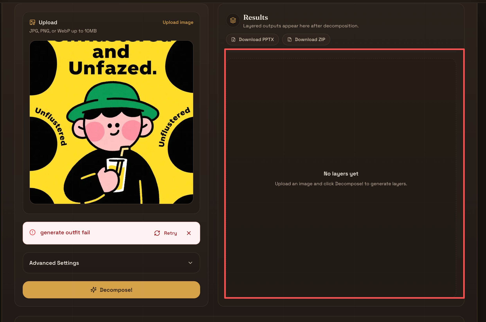
- 如果中间出现问题然后解决问题重试知道生成图片成功

# 任务25
点击Advanced Settings后出现如图的内容，字体都是黑色呀，需要修改，。加载/Users/a1-6/Desktop/code/skills-hub这个skill，使用frontend-design模仿https://raphael.app/网站的风格优化下。修改完测试下

# 任务26
点击如图中的Free trial按钮后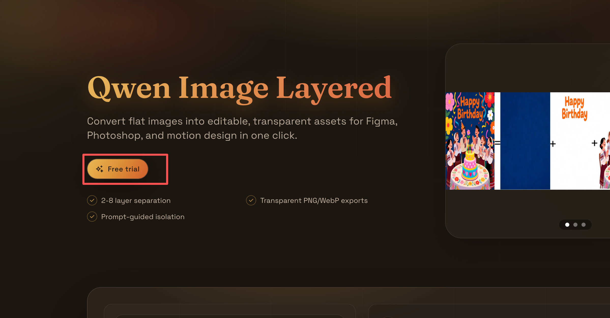，会跳转到如图红框中的内容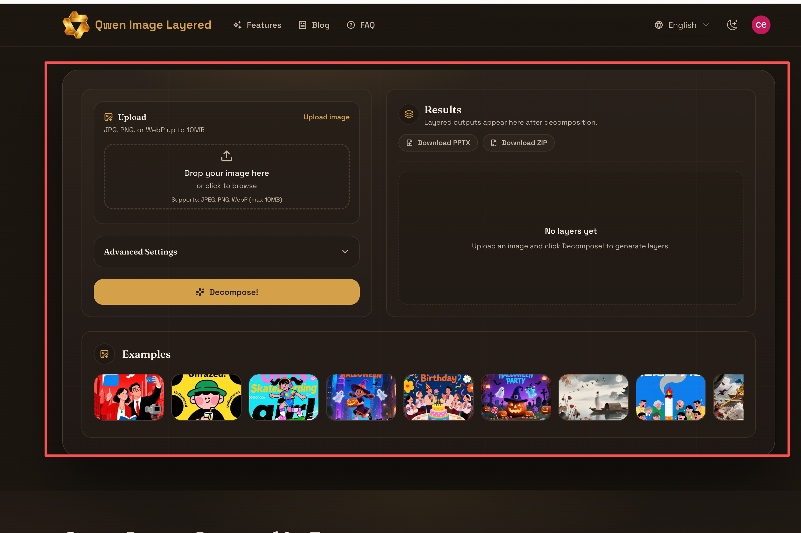。我希望点击如图红框中的Try for free按钮也跳转到相同的位置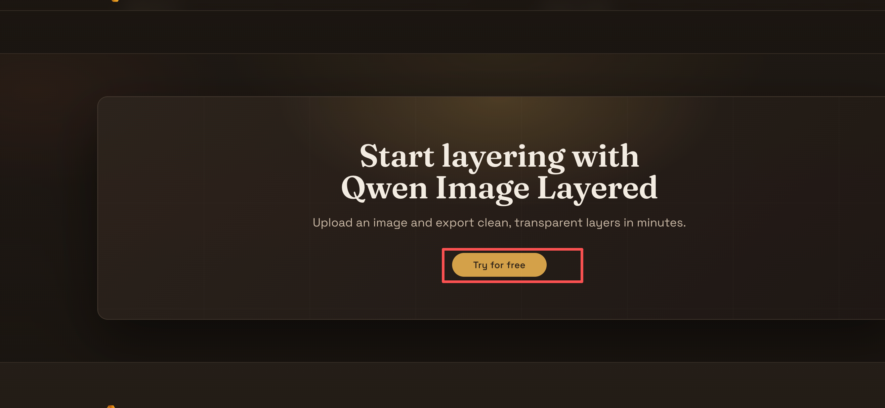